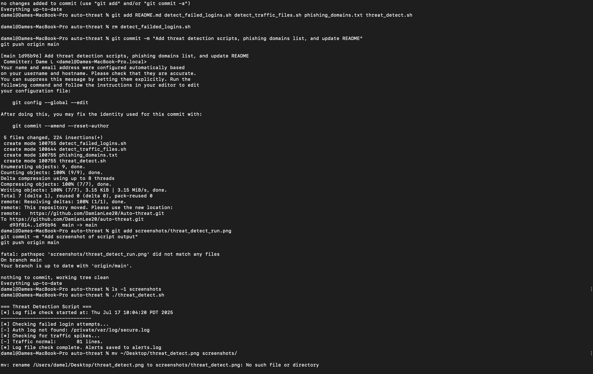

# Auto Threat Detection Toolkit

A lightweight Bash-based threat detection utility that simulates SOC monitoring workflows. Detects failed login attempts, traffic spikes, and phishing domains using system logs and custom logic — ideal for Tier 1 SOC analyst skill-building.

---

## 🔍 Features

- ✅ Failed login detection with IP threshold
- ✅ Traffic spike alerts based on system log volume
- ✅ Phishing domain matching from a custom watchlist
- ✅ Outputs alerts to a timestamped log (`alerts.log`)
- ✅ No external dependencies — pure Bash

---

## 🛠️ How It Works

- Parses system logs (`/var/log/system.log`, `/private/var/log/secure.log`)  
- Uses `awk`, `grep`, `wc`, and `bash` logic to simulate real alert trig


---

## 🚀 Setup

```bash
# Clone the repo
git clone https://github.com/DamianLee20/Auto-threat.git
cd Auto-threat

# Make the script executable
chmod +x threat_detect.sh

# Run the tool
./threat_detect.sh

AUTH_LOG="logs/mock_auth.log"
SYS_LOG="logs/mock_sys.log"

[*] Log file check started at: Thu Jul 17 09:37:10 PDT 2025
[*] Checking failed login attempts...
[!] ALERT: 6 failed logins from 192.168.1.101
[*] Checking for traffic spikes...
[!] TRAFFIC SPIKE: 1204 lines in /var/log/system.log
[*] Log file check complete. Alerts saved to alerts.log

Jul 17 09:01:23 login[101]: FAILED LOGIN from 192.168.1.101
Jul 17 09:02:01 login[101]: FAILED LOGIN from 192.168.1.101

🙋 About the Author

Damian Lee
Certified in CompTIA Security+ and Google Cybersecurity
Aspiring SOC Analyst

## 📸 Sample Output

Below is a screenshot of the script running in a test environment with mock logs:



